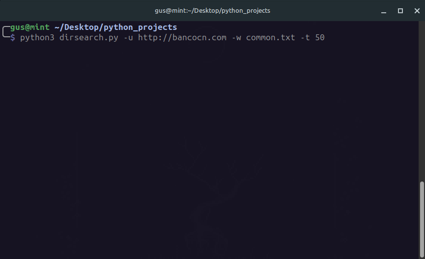

# Dirscanner 🔍

A simple and fast Python tool to scan for **hidden directories** on websites using a wordlist and multithreading.

This tool uses multithreading to test paths from a wordlist against a target URL, helping you identify hidden or unlisted directories quickly and efficiently.

<p align="center">
  
</p>

---

## 🚀 Usage

```bash
python3 dirscanner.py -u <url> -w <wordlist> -t <threads>
```

### Example:

```bash
python3 dirscanner.py -u https://example.com -w common.txt -t 30
```

---

## ⚙️ Options

- `-u`, `--url`       → Target URL (required)  
- `-w`, `--wordlist`  → Wordlist file (required)  
- `-t`, `--threads`   → Number of threads (default: 30)  

---

## ⚠️ Legal

For **educational and authorized use**
